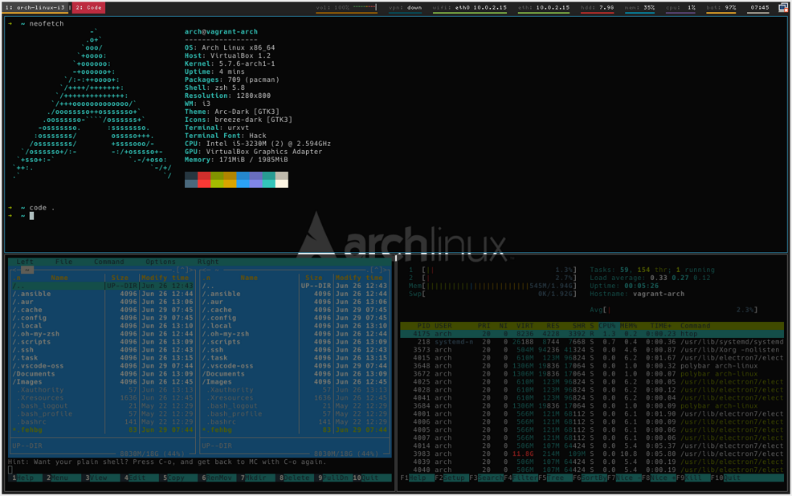

# Arch Linux with i3wm

This set of ansible scripts deploy i3 window manager and other software on top of Arch Linux.



## Installed software by default:

```
aur_packages: ['buku-git','ifuse','networkmanager-dmenu-git','qimgv-git','qnapi','pavolume-git','realvnc-vnc-viewer','winbox']
deps_base: ['base-devel','cronie','gcc','git','htop','mc','neofetch','openssh','tree','wget','vim','zsh']
deps_i3: ['alsa-utils','arc-gtk-theme','breeze-icons','dmenu','dunst','feh','libva-intel-driver','light','nemo','network-manager-applet','networkmanager-openvpn','perl','pulseaudio','pulseaudio-alsa','rxvt-unicode','ttf-dejavu','ttf-hack','unclutter','upower','xclip','xcompmgr','xf86-video-intel']
software_internet: ['youtube-dl']
software_iphone_ipad: ['libimobiledevice']
software_productivity: ['calc','dbeaver','nemo-fileroller','rsync','task','texlive-most']
software_programming: ['code','nodejs','npm']
software_social_media: ['discord']
software_system: ['dosfstools','dunst','exfat-utils','libnotify','notification-daemon','pv','usbutils','vnstat','xfsprogs']
software_virtualization: ['mesa','vagrant','virtualbox','virtualbox-host-modules-arch','wine','xf86-video-vesa','xorg']
```

## Links:

[Ansible](https://www.ansible.com) - IT Automation  
[Arch Linux](https://www.archlinux.org) - Lightweight and flexible Linux® distribution  
[i3wm](https://i3wm.org) - Tiling window manager

## Custom configs

There are two templates. For `user` and for `bookmarks`.  
Copy file, remove `template` from the name and fill data as template says.

## How to install

If you want install and you not sure if you have all needed dependencies installed
```
cd arch-linux-i3
chmod a+x arch-linux-i3.sh
./arch-linux-i3.sh
```

## Default values

Username: arch  
Password: Passw0rd

## How to test

Use `vagrant up` to create VM.  
If VM is already running use `vagrant provision` to apply changes.

## Tested on

- Asus RoG GL502VM(K)  
- Lenovo ThinkPad X230
